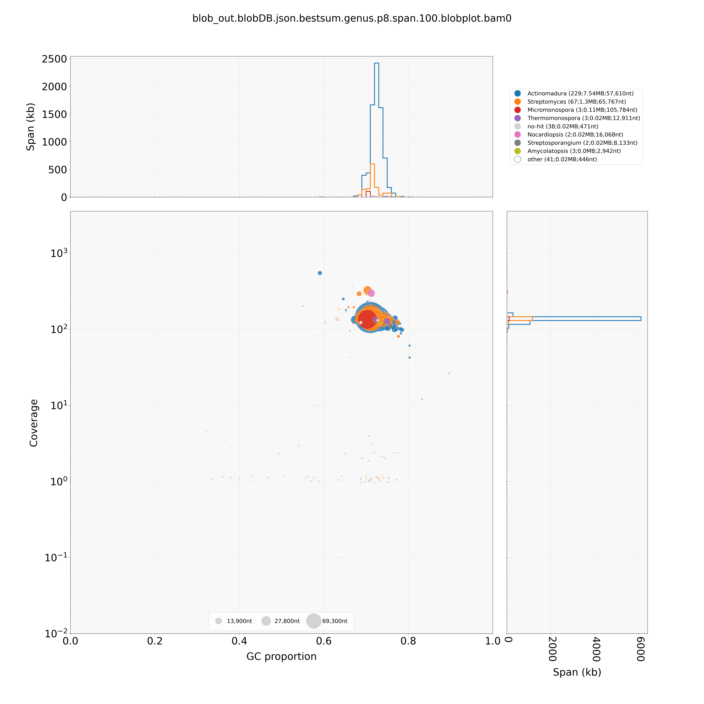
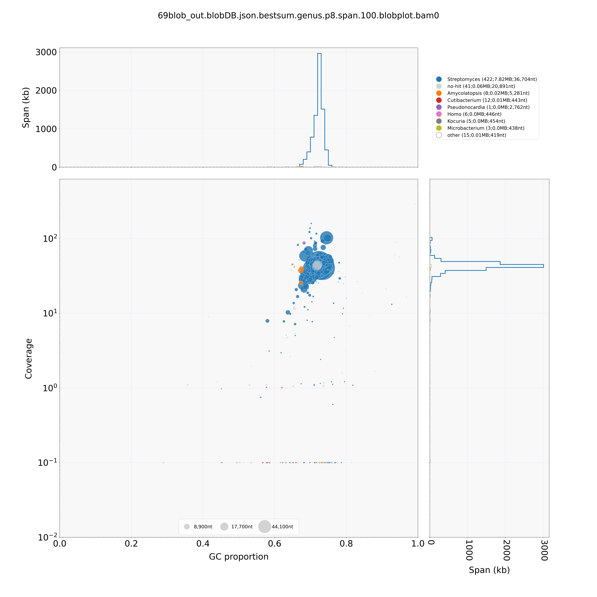
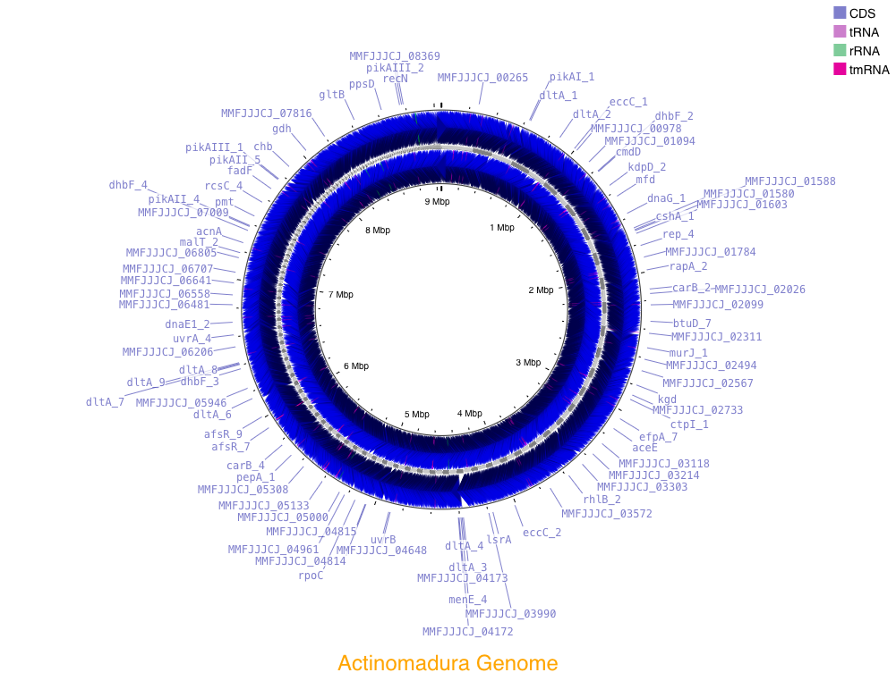
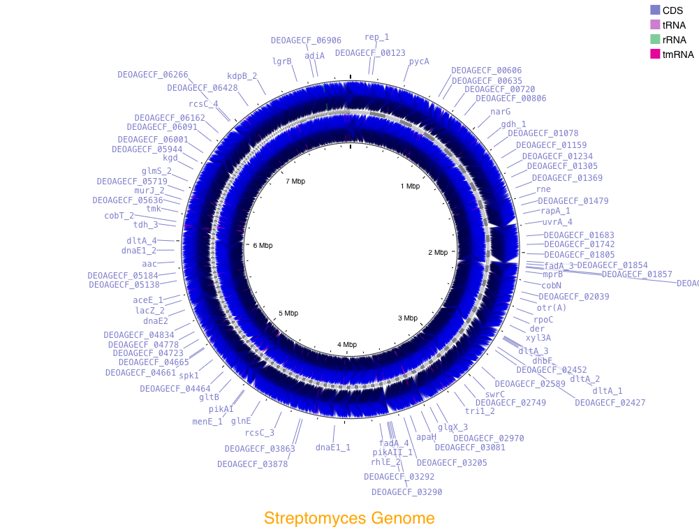

# Bacterial Genome Assembly Study  
## Study Background 

- The data was originally collected by the UNH Tech camp, who also did an initial study on the data.
- This camp was primarily composed of kids from grade 5 to 12.
- The students who specifically worked on this study include John Caparso, Alex Goin, Amino Hussein, Tonya Kirichok, Ada Milhauser, Aakansh Mysore, Nana Suarez, Olivia Tatro, Logan Quiter, and Yasmin Yan.
- This specific project was led by Joseph Sevigny, Steve Simpson, Kelley Thomas, and Andrea de Assis.
- The data and microbe collection was done in the summer of 2022 in Arcadia National Park.
- The microbe samples were sequenced utilizing Illumina Sequencing
- In this analysis, we will utilize bioinformatic coding and command-line to assemble the genome and assign taxonomy to two different samples from the above study
- There were many different genetic samples but the ones used in this project were sample 15 and sample 69 
## Methods 

  
Prep Directories and Obtain Data

  
   - We made a final project directory called "gen-711-final-project"  
   - We then pulled the forward and backward reads for samples 69 and 15 into a "raw_reads" directory
   - We also prepped the directory for the FastQC outputs
        
        
 
        
code

          
          mkdir gen-711-final-project   
          cd gen-711-final-project  
          mkdir raw_reads  
          cp /tmp/gen711_project_data/genome-assembly-fqs/69_S8_L001_R1_001.fastq.gz raw_reads  
          cp /tmp/gen711_project_data/genome-assembly-fqs/69_S8_L001_R2_001.fastq.gz raw_reads  
          cp /tmp/gen711_project_data/genome-assembly-fqs/15_S2_L001_R1_001.fastq.gz raw_reads  
          cp /tmp/gen711_project_data/genome-assembly-fqs/15_S2_L001_R2_001.fastq.gz raw_reads  
          mkdir fastqc_output
         
        

  
FastQC Analysis of Raw Reads

  - We ran the program, FastQC, to visualize the quality of our raw data

    

      
code

          
          cd raw_reads
          fastqc 69_S8_L001_R1_001.fastq.gz -o ../fastqc_output
          fastqc 69_S8_L001_R2_001.fastq.gz -o ../fastqc_output
          fastqc 15_S2_L001_R1_001.fastq.gz -o ../fastqc_output
          fastqc 15_S2_L001_R2_001.fastq.gz -o ../fastqc_output  
      
    

 

  
Trimming Raw Reads Using Trimmomatic

  - In order to increase the quality of the sequenced reads we needed to trim the data
  - The program, trimmomatic, recognizes low-quality bases and adapters and removes them from the file
  - We utilized a pre-made SH file to run the program called "trim_scriptV2.sh"
  - After running trimmomatic, we prepped the directory for FastQC analysis of the trimmed reads

    

      
code

          
          conda activate genomics
          trim_scriptV2.sh ./raw_reads/15_S2_L001_R1_001.fastq.gz ./raw_reads/15_S2_L001_R2_001.fastq.gz
          trim_scriptV2.sh ./raw_reads/69_S8_L001_R1_001.fastq.gz ./raw_reads/69_S8_L001_R2_001.fastq.gz
          mkdir ./fastqc_timmed 
      
    

  
FastQC Analysis of Trimmed Reads

  - After running trimmomatic, we ran a FastQC analysis to assess the quality of the reads
  - This allows us to analyze how the quality of reads improved after trimming them

    

      
code

          
          fastqc ./trimmed_reads/15_S2_L001_R1_001.fastq.gz -o ./fastqc_trimmed
          fastqc ./trimmed_reads/15_S2_L001_R2_001.fastq.gz -o ./fastqc_trimmed
          fastqc ./trimmed_reads/69_S8_L001_R1_001.fastq.gz -o ./fastqc_trimmed
          fastqc ./trimmed_reads/69_S8_L001_R2_001.fastq.gz -o ./fastqc_trimmed
      
    

  
Genome Assembly using SPAdes

  - Now with trimmed reads, we can assemble the genome and get contigs by utilizing an assembly program
  - We ran a program called SPAdes, which is pretty efficient at assembling bacterial genomes
  - We also used nohup and & commands in combination, as SPAdes takes a while to compute and it allows the program to run even if we turn off our computers or leave ron

    

      
code

          
          cd ~/gen-711-final-project
          nohup spades.py -1 15_S2_L001_R1_001.fastq.gz -2 15_S2_L001_R2_001.fastq.gz -s unpaired-15_S2_L001_R1_001.fastq.gz -s unpaired-15_S2_L001_R2_001.fastq.gz -o 15-spades-assembly-default -t 24 &
          nohup spades.py -1 69_S8_L001_R1_001.fastq.gz -2 69_S8_L001_R2_001.fastq.gz -s unpaired-69_S8_L001_R1_001.fastq.gz -s unpaired-69_S8_L001_R2_001.fastq.gz -o 69-spades-assembly-default -t 24 & 
      
    

  
Genome Assembly Assessment utilizing QUAST and BUSCO

  - Now with contigs, we can assess the quality of our assembly
  - The first program we ran, QUAST, tells us how well the genome was assembled and gives us valuable information such as total nucleotide length, N50, and the sizes of the individual contigs
  - The second program, BUSCO, tells us the completeness of the assembly; it can tell us how many complete, fragmented, or duplicated genes we have

    

      
code

          
          quast.py 15contigs.fasta -o quast_results_15
          quast.py 69contigs.fasta -o quast_results_69
          conda activate busco
          busco -i 15contigs.fasta -m genome -o busco-results-15 -l bacteria
          busco -i 69contigs.fasta -m genome -o busco-results-69 -l bacteria  
      
    

  
Genome Annotation Utilizing the PROKKA Pipeline

  - We ran PROKKA, which allows us to assign functions and meaning to the sequences we assembled earlier
  - the output of the program generated many files, however, GFF is the master file containing all important annotations and sequences
  - We also utilized grep to pull unique proteins associated with our assemblies and stored the abundances in a separate file

    

      
code

          
          conda activate genomics
          nohup prokka 15contigs.fasta --outdir prokka_output_15 --cpus 24 --mincontiglen 200 &
          nohup prokka 69contigs.fasta --outdir prokka_output_69 --cpus 24 --mincontiglen 200 &
          grep -o "product=.*" prokka_output_15/PROKKA_* | sed 's/product=//g' | sort | uniq -c | sort -nr > protein_abundances_15.txt
          grep -o "product=.*" prokka_output_69/PROKKA_* | sed 's/product=//g' | sort | uniq -c | sort -nr > protein_abundances_69.txt 
      
    

     

  
Extracting 16S rRNA Sequences

  - The PROKKA output assigned many different functions to our DNA sequences, including genes that code for 16S rRNA
  - We ran an extraction program that pulled 16S rRNA gene sequences into a separate file in prep for BLAST 

    

      
code

          
          extract_sequences "16S ribosomal RNA" prokka_output_15/PROKKA_05032024.ffn > 16S_sequence_15.fasta
          extract_sequences "16S ribosomal RNA" prokka_output_69/PROKKA_05032024.ffn > 16S_sequence_69.fasta
          
    

  
Organism Identification through BLAST

  - BLAST, or the Basic Local Alignment Search Tool, allows us to assign taxonomy to the samples we assembled
  - We first established a blast database using our original contig files
  - We then ran a blast comparing the database to the 16S rRNA sequences
  - Finally, we used the file, blob_blast.sh, to blast out contig sequences and output a file detailing taxonomic matches

    

      
code

          
          makeblastdb -in 15contigs.fasta -dbtype nucl -out 15contigs_db
          makeblastdb -in 69contigs.fasta -dbtype nucl -out 69contigs_db
          blastn -query 16S_sequence_15.fasta -db 15contigs_db -out 16S_vs_15contigs_6.tsv -outfmt 6
          blastn -query 16S_sequence_69.fasta -db 69contigs_db -out 16S_vs_69contigs_6.tsv -outfmt 6
          blob_blast.sh 15contigs.fasta
          blob_blast.sh 69contigs.fasta
          
    

  
Read Mapping and Coverage Analysis

  - By running both bwa mem and samtools programs, we mapped the alignment of our genomes and constructed SAM and BAM files
  - We then ran the bedtools genomecov program to calculate the coverage per contig
  - We finally ran the gen_input_table.py file to organize our calculated coverage into a table
    
    

      
code

          
          bwa index 15contigs.fasta  
          bwa index 69contigs.fasta       
          bwa mem -t 24 15contigs.fasta ./trimmed_reads/15_S2_L001_R1_001.fastq.gz ./trimmed_reads/15_S2_L001_R2_001.fastq.gz > 15raw_mapped.sam        
          bwa mem -t 24 69contigs.fasta ./trimmed_reads/69_S8_L001_R1_001.fastq.gz ./trimmed_reads/69_S8_L001_R2_001.fastq.gz > 69raw_mapped.sam      
          samtools view -@ 24 -Sb  15raw_mapped.sam  | samtools sort -@ 24 -o 15sorted_mapped.bam    
          samtools view -@ 24 -Sb  69raw_mapped.sam  | samtools sort -@ 24 -o 69sorted_mapped.bam    
          samtools flagstat 15sorted_mapped.bam      
          samtools flagstat 69sorted_mapped.bam      
          samtools index 15sorted_mapped.bam      
          samtools index 69orted_mapped.bam        
          bedtools genomecov -ibam 15sorted_mapped.bam > 15coverage.out      
          bedtools genomecov -ibam 69sorted_mapped.bam > 69coverage.out       
          gen_input_table.py  --isbedfiles 15contigs.fasta 15coverage.out >  15coverage_table.tsv    
          gen_input_table.py  --isbedfiles 69contigs.fasta 69coverage.out >  69coverage_table.tsv  
          
    

  
Visualizing Non-Target Contigs and Taxonomy Through blobtools

  - We ran the blob tools program in order to visualize the GC content, coverage, taxonomy, and contigs lengths of our genomes
  - We first converted our input files into a lookup table necessary to construct the plots; using the BLAST output to assign taxonomy and using the BAM file to give coverage information
  - We then converted that information into a human-readable table and finally converted it into a plot we can use to filter our genomes
    
    

      
code

          
          blobtools create -i 15contigs.fasta -b 15sorted_mapped.bam -t 15contigs.fasta.vs.nt.cul5.1e5.megablast.out -o 15blob_out        
          blobtools create -i 69contigs.fasta -b 69sorted_mapped.bam -t 69contigs.fasta.vs.nt.cul5.1e5.megablast.out -o 69blob_out      
          blobtools view -i 15blob_out.blobDB.json -r all -o 15blob_taxonomy        
          blobtools view -i 69blob_out.blobDB.json -r all -o 69blob_taxonomy      
          blobtools plot -i 15blob_out.blobDB.json -r genus       
          blobtools plot -i 69blob_out.blobDB.json -r genus
          
    

 

  
Filtering the Genomes

  - We first used grep programming, and 'awk' commands to read our blob output table and decide on filtering criteria to filter our genomes
  - After deciding what filtering criteria were appropriate for each genome, we used grep to grab those sequences and output the contig header to a separate file used to filter the fasta file in the next step
  - We then used the file, filter_contigs_by_list.py, to convert our original contigs to the final fasta file with our filtered genome 
    
    

      
code

          
          #in order to decide the filtering criteria, we first tested the outcomes of filtering with different lengths and coverage numbers using the below code:#  
          grep -v '#' 15blob_taxonomy.15blob_out.blobDB.table.txt | awk -F'\t' '$2 > <insert-legnth>' | awk -F'\t' '$5 < <insert-coverage>' | awk '{print $18}'     
          grep -v '#' 69blob_taxonomy.69blob_out.blobDB.table.txt | awk -F'\t' '$2 > <insert-legnth>' | awk -F'\t' '$5 < <insert-coverage>' | awk '{print $18}'  
          #once we decided on the filtering criteria, we ran the following code:#  
          grep -v '##' 15blob_taxonomy.15blob_out.blobDB.table.txt | awk -F'\t' '$2 > 500' | awk -F'\t' '$5 > 20' | awk -F'\t' '{print $1}' > 15list_of_contigs_to_keep_len500_cov20.txt    
          grep -v '##' 69blob_taxonomy.69blob_out.blobDB.table.txt | awk -F'\t' '$2 > 600' | awk -F'\t' '$5 > 10' | awk -F'\t' '{print $1}' > 69list_of_contigs_to_keep_len600_cov10.txt
          filter_contigs_by_list.py 15contigs.fasta 15list_of_contigs_to_keep_len500_cov20.txt Actinomadura_filtered.fasta
          filter_contigs_by_list.py 69contigs.fasta 69list_of_contigs_to_keep_len600_cov10.txt Streptomyces_filtered.fasta
 
    

  
Confirmation of Filtered FASTA and Visualizing Final Genome

  - We installed a nucleotide database to check for contamination
  - We ran a blast of our filtered genome, the result of the blast should be empty if no contamination was found
  - Because we found contamination in sample 69, we had to remove the contig using nano and refiltered the genome; We also checked for contamination again and found nothing
  - We utilized the program, Proksee, to visualize the genome. We utilized the GBK file output from the PROKKA genome annotation as an input to develop the circular genome visual maps. 
    
    

      
code

          
          wget "https://ftp.ncbi.nlm.nih.gov/pub/UniVec/UniVec"
          blastn -reward 1 -penalty -5 -gapopen 3 -gapextend 3 -dust yes -soft_masking true -evalue 700 -searchsp 1750000000000 -query Actinomadura_filtered.fasta -subject UniVec  -outfmt 6 -out genome_vs_univec.6
    	  blastn -reward 1 -penalty -5 -gapopen 3 -gapextend 3 -dust yes -soft_masking true -evalue 700 -searchsp 1750000000000 -query Streptomyces_filtered.fasta -subject UniVec  -outfmt 6 -out genome_vs_univec.6
    	  nano 69list_of_contigs_to_keep_len600_cov10.txt #remove the header: NODE_18_legnth_71546_cov_97.389896
    	  filter_contigs_by_list.py 69contigs.fasta 69list_of_contigs_to_keep_len600_cov10.txt Streptomyces_filtered2.fasta
          blastn -reward 1 -penalty -5 -gapopen 3 -gapextend 3 -dust yes -soft_masking true -evalue 700 -searchsp 1750000000000 -query Streptomyces_filtered2.fasta -subject UniVec  -outfmt 6 -out genome_vs_univec.6
          
    

 

## Results

### FastQC Results:

  
Sample 15

  - There was some visible improvement in read quality in the 15 samples, more so in the reverse read
  - The Adapter Content decreased dramatically, failing in raw read FastQCs and passing in the trimmed analysis
    

  
Sample 69

  - There is also some improvement in the read qualities of the 69 sample trimmed reads
  - The Adapter Content decreased dramatically, failing in raw read FastQCs and passing in the trimmed analysis
    

 

### Taxonomic Assessment and Visualization

15 Assembly:
- Majority of contigs under the Genus *Actinomadura*
- Quite a few contigs under *Streptomyces*, but *Actinomadura* is the clear major genus
- Not much difference in coverage or read length, may be hard to filter

Fig 1. Shows the contig length, coverage, and taxonomy of the unfiltered Sample 15 assembly. The size of the "blobs" indicates the length of the contigs and where they fall indicates the coverage and GC content. 

69 Assembly:
- Majority under the Genus *Streptomyces*
- Some differentiation in coverage and read length, should be easier to filter

Fig 2. Shows the contig length, coverage, and taxonomy of the unfiltered Sample 69 assembly. The size of the "blobs" indicates the length of the contigs and where they fall indicates the coverage and GC content.

### Final Visualizations

#### Sample 15 Visualization

Fig 3. Shows the visualized genome of sample 15, which was identified to be in the genus, *Actinomadura*

#### Sample 69 Visualization

Fig 4. Shows the visualized genome of sample 69, which was identified to be in the genus, *Streptomyces*

## Conclusion 

## Bibliography  
Things we need to cite
- The original study
- FastQC
- Trimmomatic
- SPAdes
- QUAST
- BUSCO
- PROKKA
- BLAST
- bwa mem
- samtools
- the premade files on jeffs github; ex. filter_contigs_by_list.py
- https://ftp.ncbi.nlm.nih.gov/pub/UniVec/UniVec
- Proksee
- Blobtools
- Chat GPT
